# Enterprise-Grade No-Login RSVP Generator Design

## Overview

The Enterprise-Grade No-Login RSVP Generator is a comprehensive wedding invitation and response management system designed for professional wedding planners, venues, and couples who require a streamlined, authentication-free solution. The system provides religion-specific templates (Hindu, Christian, Islamic) with enterprise-level features including bulk generation, advanced analytics, and professional-grade customization options.

### Key Value Propositions
- **Zero Authentication Friction**: No user registration or login required for both creators and guests
- **Religion-Specific Templates**: Culturally authentic designs with traditional elements and terminology
- **Enterprise Scalability**: Bulk generation capabilities for wedding planning businesses
- **Professional Analytics**: Comprehensive tracking and reporting for business insights
- **Mobile-First Design**: Optimized for guest interaction on mobile devices

## Technology Stack & Dependencies

### Core Technologies
- **Frontend Framework**: React 18.3.1 with TypeScript 5.6.3
- **UI Components**: Radix UI with Tailwind CSS 3.4.17
- **State Management**: React Query 5.60.5 for API caching and synchronization
- **Database**: Cloudflare D1 (SQLite-compatible) with Drizzle ORM 0.39.3
- **Backend**: Cloudflare Workers with Express.js 4.21.2
- **Build Tool**: Vite 5.4.14

### Enterprise Extensions
- **QR Code Generation**: qrcode library for instant invitation sharing
- **Data Export**: CSV/Excel export capabilities for guest management
- **Analytics**: Performance tracking with Core Web Vitals monitoring
- **Security**: CSP headers, anti-copy protection, and input sanitization

## Component Architecture

### Core Component Hierarchy


### Component Specifications

#### EnterpriseRSVPGenerator (Main Container)
```typescript
interface EnterpriseRSVPGeneratorProps {
  mode: 'single' | 'bulk' | 'template-preview';
  initialData?: Partial<WeddingData>;
  onGenerated?: (results: GenerationResult[]) => void;
}

interface GenerationResult {
  weddingId: string;
  template: ReligionTemplate;
  rsvpLink: string;
  qrCodeUrl: string;
  dashboardLink: string;
  analytics: AnalyticsConfig;
}
```

#### TemplateSelector Component
```typescript
interface TemplateConfig {
  id: ReligionTemplate;
  name: string;
  description: string;
  culturalElements: string[];
  colorScheme: ColorPalette;
  typography: TypographyConfig;
  iconSet: IconConfiguration;
}

interface ReligionTemplates {
  hindu: TemplateConfig;
  christian: TemplateConfig;
  islamic: TemplateConfig;
}
```

#### BulkGenerationEngine
```typescript
interface BulkGenerationRequest {
  template: ReligionTemplate;
  weddings: WeddingData[];
  configuration: GenerationConfig;
}

interface GenerationConfig {
  enableAnalytics: boolean;
  qrCodeSize: 'small' | 'medium' | 'large';
  exportFormat: 'json' | 'csv' | 'excel';
  batchSize: number;
}
```

## Religion-Specific Template Architecture

### Hindu Template Design System

```mermaid
classDiagram
    class HinduTemplate {
        +colorPalette: OrangeRedYellow
        +symbols: ["🕉️", "Crown", "Flower2", "Sparkles"]
        +typography: DevanagariSupport
        +culturalElements: ["Om Symbol", "Mandala Patterns", "Lotus Motifs"]
        +ceremonialTerms: ["Vivah", "Kanyadaan", "Saptapadi"]
        +renderInvitation(): JSX.Element
        +validateCulturalCompliance(): boolean
    }
    
    class ChristianTemplate {
        +colorPalette: GoldWhiteBlue
        +symbols: ["✝️", "Dove", "Rings", "Bell"]
        +typography: ClassicSerif
        +culturalElements: ["Cross", "Biblical Verses", "Church Architecture"]
        +ceremonialTerms: ["Holy Matrimony", "Sacred Union", "Blessing"]
        +renderInvitation(): JSX.Element
        +validateCulturalCompliance(): boolean
    }
    
    class IslamicTemplate {
        +colorPalette: GreenGoldWhite
        +symbols: ["☪️", "Geometric Patterns", "Calligraphy"]
        +typography: ArabicSupport
        +culturalElements: ["Islamic Geometry", "Arabesque", "Crescent Moon"]
        +ceremonialTerms: ["Nikah", "Walima", "Barakallahu"]
        +renderInvitation(): JSX.Element
        +validateCulturalCompliance(): boolean
    }
```



### Template Cultural Specifications

#### Hindu Template Features
- **Visual Elements**: Om symbol (🕉️), marigold patterns, rangoli-inspired borders
- **Color Scheme**: Saffron (#FF6B35), Deep Red (#C5282F), Golden Yellow (#FFD23F)
- **Typography**: Sanskrit-compatible fonts with Devanagari script support
- **Cultural Terms**: "Mangal Milan", "Shubh Vivah", "Saptapadi ceremony"
- **Ceremonial Sections**: Haldi, Mehendi, Sangeet, Pheras, Reception

#### Christian Template Features
- **Visual Elements**: Cross (✝️), doves, wedding bells, biblical roses
- **Color Scheme**: Ivory (#F8F6F0), Royal Blue (#2E5BBA), Gold Accent (#D4AF37)
- **Typography**: Classic serif fonts (Playfair Display, Times New Roman)
- **Cultural Terms**: "Holy Matrimony", "Sacred Covenant", "Divine Blessing"
- **Ceremonial Sections**: Ceremony, Vows Exchange, Reception, Fellowship

#### Islamic Template Features
- **Visual Elements**: Crescent moon (☪️), geometric patterns, Arabic calligraphy
- **Color Scheme**: Islamic Green (#00A86B), Calligraphy Gold (#D4AF37), Pearl White (#F8F6F0)
- **Typography**: Arabic script support with Naskh and Thuluth styles
- **Cultural Terms**: "Nikah Ceremony", "Walima Reception", "Barakallahu Lakuma"
- **Ceremonial Sections**: Nikah, Walima, Mehndi, Rukhsati

## Enterprise Data Models

### Wedding Data Structure
```typescript
interface EnterpriseWeddingData {
  // Core Information
  brideName: string;
  groomName: string;
  weddingDate: Date;
  template: 'hindu' | 'christian' | 'islamic';
  
  // Venue Information
  ceremonyVenue: VenueDetails;
  receptionVenue?: VenueDetails;
  
  // Timing
  ceremonyTime: TimeSlot;
  receptionTime?: TimeSlot;
  
  // Contact & Business
  primaryContact: ContactInfo;
  secondaryContact?: ContactInfo;
  plannerInfo?: WeddingPlannerInfo;
  
  // Enterprise Features
  branding?: BrandingConfig;
  analytics: AnalyticsConfig;
  guestCapacity: GuestCapacityConfig;
  
  // Cultural Customization
  customElements?: CulturalCustomization;
  languagePreferences?: LanguageConfig;
}

interface VenueDetails {
  name: string;
  address: AddressDetails;
  coordinates?: GeographicCoordinates;
  capacity: number;
  amenities: string[];
  accessibilityFeatures?: string[];
}

interface AnalyticsConfig {
  trackResponses: boolean;
  generateReports: boolean;
  realTimeUpdates: boolean;
  exportOptions: ExportFormat[];
  retentionPeriod: number; // days
}
```

### RSVP Response Schema
```typescript
interface EnterpriseRSVPResponse {
  // Guest Information
  guestName: string;
  guestEmail: string;
  guestPhone?: string;
  
  // Attendance Details
  ceremonyAttendance: AttendanceStatus;
  receptionAttendance: AttendanceStatus;
  numberOfGuests: number;
  guestNames?: string[];
  
  // Preferences
  dietaryRestrictions?: DietaryPreference[];
  accessibilityNeeds?: AccessibilityRequirement[];
  accommodationNeeds?: AccommodationRequest;
  
  // Cultural Specific
  culturalPreferences?: CulturalPreference[];
  languagePreference?: SupportedLanguage;
  
  // Analytics
  submissionTimestamp: Date;
  deviceInfo: DeviceMetadata;
  responseTime: number; // seconds
  source: ResponseSource;
}

enum AttendanceStatus {
  ATTENDING = 'attending',
  NOT_ATTENDING = 'not_attending',
  MAYBE = 'maybe',
  PENDING = 'pending'
}

enum ResponseSource {
  DIRECT_LINK = 'direct_link',
  QR_CODE = 'qr_code',
  SOCIAL_SHARE = 'social_share',
  EMAIL_INVITATION = 'email_invitation'
}
```

## Enterprise Features Architecture

### Bulk Generation System


### Analytics and Reporting System


### Performance Optimization Strategy

#### Component Optimization
- **Lazy Loading**: Template components loaded on-demand
- **Memoization**: React.memo for template renderers
- **Virtual Scrolling**: For bulk generation results
- **Progressive Enhancement**: Core functionality first, analytics second

#### Data Management
- **Caching Strategy**: React Query with 5-minute stale time
- **Local Storage**: Template preferences and form data
- **CDN Optimization**: Static assets and QR codes
- **Database Indexing**: Optimized queries for wedding lookups

## Security & Compliance Architecture

### Data Protection Measures
```typescript
interface SecurityConfig {
  inputSanitization: {
    htmlEscape: boolean;
    sqlInjectionPrevention: boolean;
    xssProtection: boolean;
  };
  
  dataRetention: {
    anonymizeAfterDays: number;
    purgeAfterDays: number;
    encryptPII: boolean;
  };
  
  accessControl: {
    rateLimiting: RateLimitConfig;
    ipWhitelisting?: string[];
    geoBlocking?: string[];
  };
}

interface RateLimitConfig {
  generationsPerHour: number;
  responsesPerMinute: number;
  bulkOperationsPerDay: number;
}
```

### Privacy Implementation
- **Data Minimization**: Collect only essential information
- **Anonymization**: Guest data anonymized after event completion
- **Consent Management**: Clear opt-in/opt-out mechanisms
- **Right to Deletion**: Automated data purge functionality

## Integration Capabilities

### Third-Party Service Integration


### API Architecture
```typescript
interface EnterpriseAPIEndpoints {
  // Generation
  '/api/enterprise/generate': {
    method: 'POST';
    payload: BulkGenerationRequest;
    response: GenerationResult[];
  };
  
  // Analytics
  '/api/enterprise/analytics/{weddingId}': {
    method: 'GET';
    response: AnalyticsReport;
  };
  
  // Export
  '/api/enterprise/export/{weddingId}': {
    method: 'GET';
    params: { format: ExportFormat };
    response: Blob;
  };
  
  // Webhook
  '/api/enterprise/webhook/{weddingId}': {
    method: 'POST';
    payload: WebhookEvent;
    response: AcknowledgmentStatus;
  };
}
```

## Deployment Architecture

### Scalability Configuration
```typescript
interface DeploymentConfig {
  cloudflare: {
    workers: {
      cpu: 'unlimited';
      memory: '128MB';
      timeout: '30s';
    };
    
    d1Database: {
      readReplicas: 3;
      writeReplicas: 1;
      backupRetention: '30 days';
    };
    
    pages: {
      buildTimeout: '20 minutes';
      functionTimeout: '10 seconds';
      assetCaching: '1 year';
    };
  };
  
  monitoring: {
    errorTracking: boolean;
    performanceMonitoring: boolean;
    uptime: boolean;
    customMetrics: string[];
  };
}
```

### Environment Configuration
- **Development**: Local SQLite with hot-reload
- **Staging**: Cloudflare D1 with reduced limits
- **Production**: Full Cloudflare stack with analytics
- **Enterprise**: Custom deployment with SLA guarantees