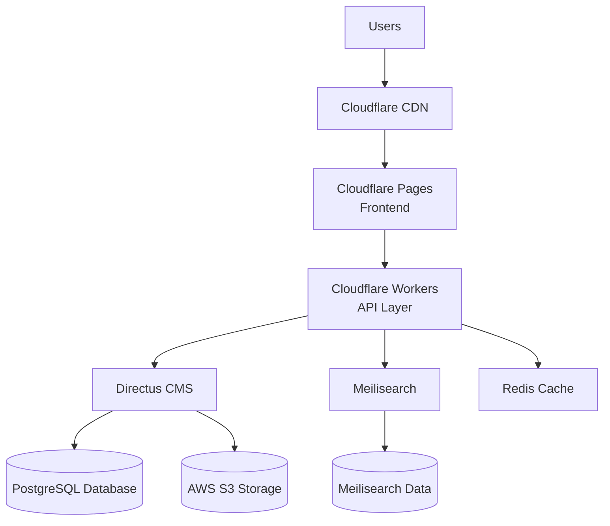

# TheGoanWedding Production Deployment Guide

This comprehensive guide covers the complete deployment process for TheGoanWedding platform, including all services, monitoring, and rollback procedures.

## 🚀 Production Deployment Automation

### Deployment Script
The project includes a production deployment automation script:

```bash
# Deploy to production
npm run deploy:production

# Deploy to staging
npm run deploy:staging

# Verify deployment health
npm run deploy:verify
```

### Deployment Process
1. Deploy Directus to Railway/Render
2. Update Cloudflare Workers environment variables
3. Run data migration if needed
4. Verify all services are healthy

## ⚙️ Environment-Specific Configurations

### Cloudflare Workers Configuration
- `wrangler.production.toml` for production
- `wrangler.toml` for staging

### Directus Production Configuration
- `directus-cms/config.production.js` with PostgreSQL, Redis, and S3 storage

### Meilisearch Production Setup
- `meilisearch/production.toml` with SSL and performance settings

## 🔄 Deployment Commands

| Command | Description |
|---------|-------------|
| `npm run deploy:staging` | Deploy to staging environment |
| `npm run deploy:production` | Deploy to production |
| `npm run deploy:verify` | Check deployment health |
| `npm run rollback` | Rollback deployment |
| `npm run monitor:setup` | Setup monitoring |

## 🛡️ Rollback Procedures

### Automated Rollback
The deployment system includes automated rollback procedures:

```bash
# Rollback all services
npm run rollback all

# Rollback specific service
npm run rollback frontend
npm run rollback directus
npm run rollback meilisearch
npm run rollback workers
```

### Manual Rollback Steps
1. Identify the failed service
2. Revert to the previous deployment version
3. Update environment variables if needed
4. Verify service health
5. Notify the team

## 📊 Monitoring Setup

### Monitoring Services
1. **Uptime Monitoring** - Service availability and response times
2. **Performance Monitoring** - Application performance and user experience
3. **Error Tracking** - Application errors and exceptions
4. **Log Aggregation** - Centralized log analysis
5. **Database Monitoring** - Database performance and queries

### Alerting Configuration
- Service downtime alerts
- Performance degradation alerts
- Error rate spike alerts
- Resource utilization alerts

### Dashboard Setup
- Grafana dashboards for visualization
- Real-time metrics panels
- Historical data analysis

## 🔧 Environment Variables

### Required Production Variables
```env
# Directus Configuration
DIRECTUS_URL=https://directus.thegoanwedding.com
DIRECTUS_TOKEN=your-directus-token
USE_DIRECTUS=true

# Meilisearch Configuration
MEILISEARCH_HOST=https://meilisearch.thegoanwedding.com
MEILISEARCH_API_KEY=your-meilisearch-key

# Cloudflare Configuration
CF_ACCOUNT_ID=your-account-id
CF_API_TOKEN=your-api-token

# Database Configuration
DB_HOST=your-db-host
DB_USER=your-db-user
DB_PASSWORD=your-db-password
DB_NAME=directus_production

# Storage Configuration
STORAGE_S3_KEY=your-s3-key
STORAGE_S3_SECRET=your-s3-secret
STORAGE_S3_BUCKET=thegoanwedding-assets
```

## 📁 Deployment Architecture

### Services
1. **Frontend** - Cloudflare Pages
2. **Backend** - Cloudflare Workers
3. **CMS** - Directus (Railway/Render)
4. **Search** - Meilisearch (Railway/Render)
5. **Database** - PostgreSQL
6. **Cache** - Redis
7. **Storage** - AWS S3

### Infrastructure Diagram


## 🔄 CI/CD Pipeline

### GitHub Actions Workflow
```yaml
name: Deploy to Production
on:
  push:
    branches: [ main ]
  workflow_dispatch:

jobs:
  test:
    runs-on: ubuntu-latest
    steps:
      - uses: actions/checkout@v3
      - name: Setup Node.js
        uses: actions/setup-node@v3
        with:
          node-version: '18'
      - name: Install dependencies
        run: npm ci
      - name: Run tests
        run: npm test

  deploy:
    needs: test
    runs-on: ubuntu-latest
    steps:
      - uses: actions/checkout@v3
      - name: Setup Node.js
        uses: actions/setup-node@v3
        with:
          node-version: '18'
      - name: Install dependencies
        run: npm ci
      - name: Deploy to production
        run: npm run deploy:production
        env:
          DIRECTUS_TOKEN: ${{ secrets.DIRECTUS_TOKEN }}
          CF_ACCOUNT_ID: ${{ secrets.CF_ACCOUNT_ID }}
          CF_API_TOKEN: ${{ secrets.CF_API_TOKEN }}
          MEILISEARCH_API_KEY: ${{ secrets.MEILISEARCH_API_KEY }}
```

## 🧪 Deployment Testing

### Pre-deployment Checklist
- [ ] All tests pass
- [ ] Code review completed
- [ ] Security scan passed
- [ ] Performance benchmarks met
- [ ] Database migrations tested

### Post-deployment Verification
- [ ] Service health checks
- [ ] User acceptance testing
- [ ] Performance monitoring
- [ ] Error rate monitoring
- [ ] User feedback collection

## 🆘 Troubleshooting

### Common Deployment Issues
1. **Environment Variable Errors**
   - Verify all required variables are set
   - Check variable naming conventions
   - Ensure proper escaping of special characters

2. **Service Connection Failures**
   - Check network connectivity between services
   - Verify authentication credentials
   - Review firewall and security group settings

3. **Database Migration Issues**
   - Review migration scripts for errors
   - Check database permissions
   - Verify schema compatibility

4. **Performance Degradation**
   - Monitor resource utilization
   - Check for memory leaks
   - Review query performance

### Emergency Procedures
1. **Immediate Rollback**
   - Execute `npm run rollback all`
   - Notify team and stakeholders
   - Document the incident

2. **Service Isolation**
   - Identify the affected service
   - Isolate the service if possible
   - Implement temporary fixes

3. **Communication Protocol**
   - Notify users about the issue
   - Provide regular status updates
   - Post-incident analysis and reporting

## 📈 Performance Optimization

### Frontend Optimization
- Asset compression and minification
- CDN caching strategies
- Lazy loading implementation
- Image optimization

### Backend Optimization
- Database query optimization
- Caching strategies
- Connection pooling
- Load balancing

### Search Optimization
- Index optimization
- Query performance tuning
- Result caching
- Facet configuration

## 🔐 Security Considerations

### Access Control
- Role-based access control
- API key management
- Authentication and authorization
- Session management

### Data Protection
- Encryption at rest and in transit
- Regular security audits
- Vulnerability scanning
- Penetration testing

### Compliance
- GDPR compliance
- Data retention policies
- Privacy policy implementation
- User consent management

## 📊 Monitoring and Analytics

### Key Metrics
- Application response time
- Error rates and exceptions
- User engagement metrics
- Conversion rates
- System resource utilization

### Reporting
- Daily health reports
- Weekly performance summaries
- Monthly analytics reviews
- Quarterly business reviews

## 🔄 Backup and Recovery

### Data Backup Strategy
- Daily database backups
- Weekly full system backups
- Monthly archival backups
- Automated backup verification

### Recovery Procedures
- Database restore procedures
- Service recovery steps
- Data consistency checks
- Post-recovery validation

## 📞 Support and Maintenance

### Support Channels
- 24/7 monitoring and alerting
- Dedicated support team
- User feedback collection
- Incident response procedures

### Maintenance Windows
- Scheduled maintenance notifications
- Automated maintenance tasks
- System update procedures
- Downtime minimization strategies

## 📚 Documentation and Training

### Operational Documentation
- Deployment procedures
- Troubleshooting guides
- Runbooks for common issues
- Architecture documentation

### Team Training
- Onboarding procedures
- Role-specific training
- Cross-training initiatives
- Knowledge sharing sessions

This comprehensive deployment guide ensures that TheGoanWedding platform can be reliably deployed, monitored, and maintained in production environments with minimal downtime and maximum performance.